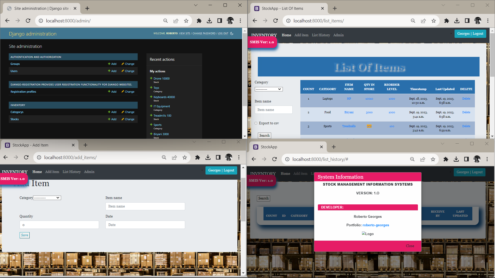

# Stock-Management-System
Developing an SMIS

## About

This is a system which aims at digitizing the stock journey of items in industries.

It is scalabale and can be used at any level.

Currently, it is purely web but with capability of scaling down to mobile apps.

  SMIS is aimed at aiding in collection of digital data on: 
  - Initial input of current stock 
  - Setting alert on stock if quantity decreases 
  - Adding stock to existing one 
  - Tracking issued stock 
  - Viewing history of recent/specific transaction 
  - Exporting data that can be trained for further uses (DATA - AI)

Developed with love by Dev Georges <a href="https://roberto-georges.vercel.app">(Portfolio)

## Web Preview
Below is a short preview of how the system looks like: 

## Table of Contents
1. Stock Management System
2. About
3. Web Preview
4. Table of Contents
5. <a href="## Technologies">Technologies</a> 
   - <a href="## Technologies">Languages</a> 
   - <a href="## Technologies">Frameworks</a> 
6. User Journey
7. Contact
8. Gratitude
   
## Technologies

### Languages
  - Python
  - HTML/CSS
  
### Frameworks
- Django
- Bootstrap

## User Journey
1. Create account
2. Log in to the system
3. Once logged in, a user can view current list of items in stock
4. They can set a reorder alert, add items, delete items, view history and print report
5. They are also able to export specific lists in various formats eg CSV(EXcel)
6. They are able to issue or receive particular items
7. Ability to log out

## etc
Contact the Developer: 
Gmail -> @<a href-="mailto:georgesroberto21@gmail.com">georgesroberto21@gmail.com 
Call  -> @<a href-="tel:+254796807438">+254796807438 

## THANKS FOR VISITING MY PAGE.
<a href="https://github.com/georgesroberto/georgesroberto">HOME</a>
